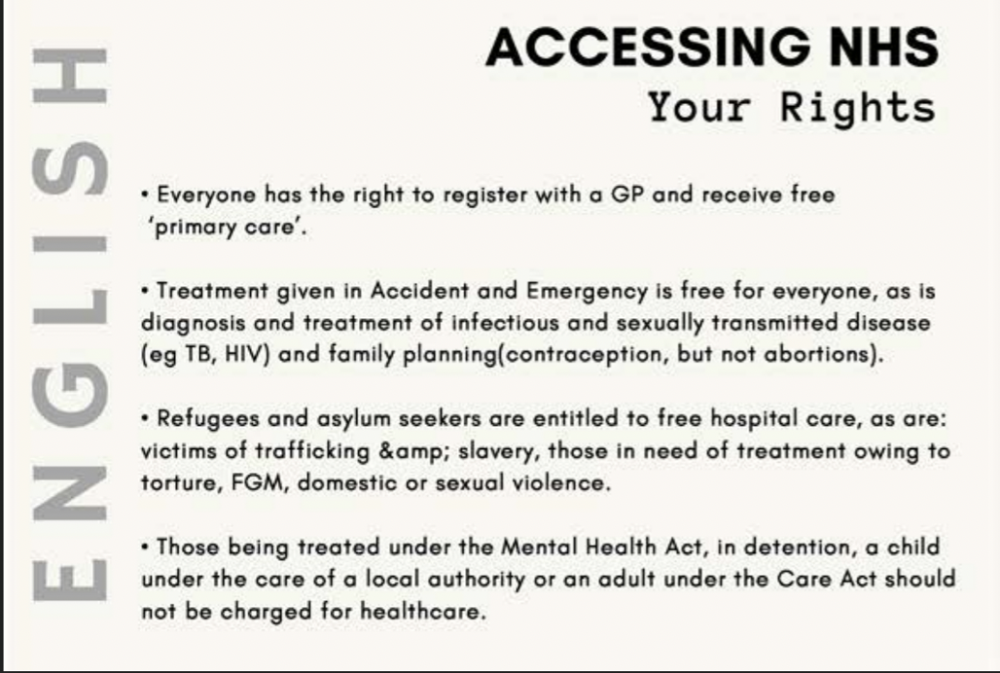
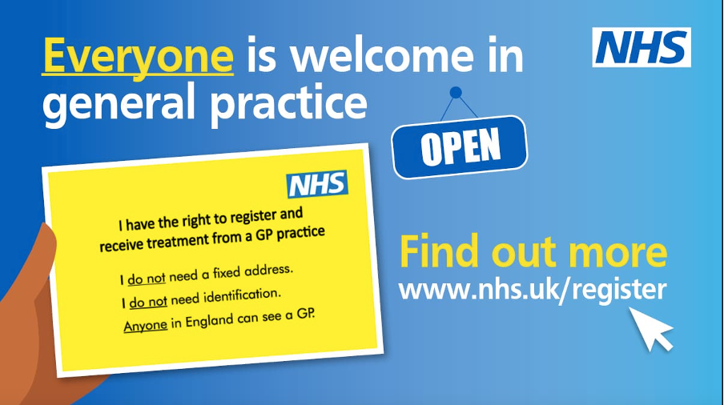

# Digital Privacy & Security Guide
### *For migrant domestic workers*

## Table of Contents
* [About this guide](#about-this-guide)
  * [Who produced this guide?](#who-produced-this-guide)
  * [Purpose of this guide](#purpose-of-this-guide)
* [General digital privacy and security advice](#general-digital-privacy-and-security-advice)
* [Immigration and government surveillance](#immigration-and-government-surveillance)
  * [Problem](#problem)
  * [Practical advice](#practical-advice)
  * [Further resources](#further-resources-1)
* [Online scams and harassment](#online-scams-and-harassment)
  * [Problem](#problem-1)
  * [Practical advice](#practical-advice-1)
  * [Further resources](#further-resources-2)
* [Employer monitoring](#employer-monitoring)
  * [Problem](#problem-2)
  * [Practical advice](#practical-advice-2)
  * [Further resources](#further-resources-3)
* [Broader changes](#broader-changes)

***Date published: 16 September 2021***

***Date last updated: 29 September 2021***

## About this guide

### Purpose of this guide
This guide is for migrant domestic workers in the UK and elsewhere to keep themselves safe and protect their privacy both online and offline. Privacy refers to how much others (such as the government, employers or even friends and family) can access information about you. We are also concerned with defending against “surveillance”, which is a word for close monitoring and observation by someone in power.

| Key term | |
| --- | --- |
| `Privacy` | How much information you want others (such as the government, employers or even friends and family) to know about you |
| `Surveillance` | Close monitoring and observation by someone in power, such as the government or an employer |

Our guide starts with some general advice for staying safe online. The guide then focuses on three specific kinds of privacy threat: government surveillance; online scams and strangers; and employer monitoring. These are the threats that domestic workers identified and described to us in five online workshops in May-June 2021.

Each section includes a summary of the problem, practical steps you can take to defend yourself, and further resources. We conclude with calling for broader changes which should happen to keep domestic workers safe. This is because we do not think you should have to be responsible for worrying about your safety all the time: laws, technology and employment practices should be changed to create a fairer and safer world for domestic workers.

### Who produced this guide?
This guide was put together by a team of researchers at the University of Oxford and King’s College London, in collaboration with [Voice of Domestic Workers](https://www.thevoiceofdomesticworkers.com/), an education and support group run by and for migrant domestic workers and [Migrants Organise](https://www.migrantsorganise.org/), a grassroots platform where migrants and refugees organise for justice.

We produced the guide after five workshops with migrant domestic workers, where we discussed different threats to digital privacy and security and advice for staying safe.

**Disclaimer:** This guide is intended to provide general information and is not a substitute for getting legal advice. If you need advice on your individual situation, you should contact a solicitor or advice organisation, such as [Voice Of Domestic Workers](https://www.thevoiceofdomesticworkers.com/), [Kalayaan](http://www.kalayaan.org.uk/contact-us/), [Praxis](https://www.praxis.org.uk/get-help), [ASIRT](http://asirt.org.uk/), [Hackney Migrant Centre](https://hackneymigrantcentre.org.uk/drop-in/),
[Kanlungan](https://www.kanlungan.org.uk/?page_id=829), [Rights of Women](https://rightsofwomen.org.uk/get-advice/) or the [Anti-Trafficking and Labour Exploitation Unit](https://atleu.org.uk/).

Contributors: 
- Julia Slupska, University of Oxford
- Marissa Begonia, Voice of Domestic Workers
- Nayana Prakash, University of Oxford
- Selina Cho, University of Oxford
- Ruba Abu-Salma, King’s College London
- Mallika Balakrishnan, Migrants Organise
- Natalie Sedacca, University of Exeter & Kalayaan Trustee

If you have any questions or feedback, email us at: reconfigure2020 [at] gmail [dot] com

## General digital privacy and security advice
**Think before you click**
- Do not click on or download anything you don’t trust
- Be careful about giving personal information away

**Get comfortable with your site’s privacy settings**

You can check out these quick privacy guides for your favourite sites to understand which privacy options they have. Wherever possible, it is valuable to reduce how much information about you is public and accessible online. Sometimes these settings can be confusing; you don’t have to read all of these guides, but you may find the links helpful to have. One way to make this easier is teaming up with a friend to check your privacy settings together.
- [Facebook](https://www.facebook.com/about/basics/stay-safe-and-secure)
- [Google (Gmail, Google Photos, YouTube, etc.)](https://myaccount.google.com/security?pli=1)
- [imo](https://www.ecpat.lk/wp-content/uploads/2015/12/Imo-Security-Privacy-Settings.pdf)
- [Instagram](https://heresthethingblog.com/2015/04/28/7-privacy-tips-instagram//)
- [Snapchat](https://support.snapchat.com/en-US/a/privacy-settings2)
- [Telegram](https://privacyinternational.org/guide-step/3952/telegram-account-settings)
- [TikTok](https://support.tiktok.com/en/account-and-privacy/account-privacy-settings/privacy-controls)
- [Tumblr](https://tumblr.zendesk.com/hc/en-us/sections/205844687-Account-security)
- [Twitter](https://help.twitter.com/en/safety-and-security/twitter-privacy-settings)
- [WhatsApp](https://faq.whatsapp.com/general/security-and-privacy/how-to-change-your-privacy-settings/?lang=en)

**Take time to secure your accounts and devices**
- Make sure you have a **strong password** for your email accounts that you don't use anywhere else. If you’re worried about remembering lots of different passwords, you can use a [password manager](https://www.ncsc.gov.uk/blog-post/what-does-ncsc-think-password-managers).
  - Some websites let you add a second step when you log in to your account – this is known as ‘two-factor authentication’. This makes it harder for scammers to access your accounts. [Find out how to set up two-factor authentication](https://www.ncsc.gov.uk/guidance/setting-two-factor-authentication-2fa) across services like Gmail, Facebook, Twitter, LinkedIn, Outlook and iTunes on the National Cyber Security Centre website.

- Consider using **antivirus software** on your laptop or phone, and if you already have it, make sure it is up to date to give you more protection.
- Check if your details have been shared online (the website Have I Been Pwned can help you [check whether your accounts have been put at risk](https://haveibeenpwned.com/). If one of your accounts have been breached, change your password.
- Check if your website’s connection is secure (look for HTTPs lock icons in the browser address bar). Try to avoid visiting websites where HTTPs has not been enabled (that is, HTTP).

### Further resources:
- [DIY Guide to Feminist Cybersecurity](https://hackblossom.org/cybersecurity/)
- [EFF Surveillance Self Defence Guide](https://ssd.eff.org/en)
- [Privacy International: A guide for migrants and asylum rights organisations about privacy settings](https://privacyinternational.org/act/migrants-asylum-rights-organisations-privacy-settings)

## Immigration and government surveillance
### Problem
The UK’s ‘hostile environment’ can make life in the UK difficult and expensive, especially if you do not have indefinite leave to remain. Many workers reported a fear of government institutions, specifically the Home Office and the police, due to the power these structures have over the immigration status of workers. You might feel concern or confusion about your rights, from topics like accessing healthcare in the UK to seeking advice and protection from excessive policing.

### Practical advice
No matter your immigration status in the UK, your human rights matter! Here are some practical steps you can take:
- **Join an organisation** such as [Voice of Domestic Workers](https://www.thevoiceofdomesticworkers.com/), which can provide a sense of community as well as help you learn and mobilise on relevant issues.
- **Join a union** such as [Unite the Union](https://www.unitetheunion.org/) (one of the UK’s largest trade unions), which can offer advice and help you understand your legal rights at work. They can also communicate on your behalf with legal aid organisations and lawyers.
- **Make a note** of legal aid organisations or law centres in your area - the Law Centres Network can provide legal advice on immigration along with other concerns, such as employment, housing and healthcare.
- **Know your rights.** This can apply to a wide range of issues, for example, health, housing and employment. [Kalayaan](http://www.kalayaan.org.uk/contact-us/), a London-based charity for domestic workers, also suggests the following advice:
  - Keep a copy of your passport and Biometric Residence Permit (PRB) and give a copy to a trusted friend or relative.
  - Open an email account that your employer cannot access and give the password to a trusted friend.
  - Give the contact details of your employer and any support organisations that are helping you to your family in your country.
  - Do not keep large sums of money at home. Keep it in a safe place such as a bank or post office. Do not lend money to or borrow money from people you do not know very well.
  - If you are going alone to an employer’s home for a job interview, give the address and phone number to a friend or relative and tell them when you expect to be back.
  - Keep the numbers of people and organisations that you can call when you need help with you at all times – these could include your local police station, your solicitor, your friends, [Voice of Domestic Workers](https://www.thevoiceofdomesticworkers.com/), [Kalayaan](http://www.kalayaan.org.uk/contact-us/) and other support organisations.
  - Note that employers are not allowed to hold on to your passport or any of your other official documents, except if they are completing a right to work check, which should take no more than a day. If your employer is holding onto your passport without your agreement, they could be breaking the law.

**WHAT TO DO IF YOU ARE STOPPED BY IMMIGRATION OFFICERS**

If immigration officers or the police stop you in the street and ask about your immigration status:
- You DO NOT have to answer any questions.
- You DO NOT have to tell them your name or address.
- Tell them that you do not want to talk to them.
- Stay polite but confident.
- You can walk away.

You can find more information from Anti Raids [here](http://antiraids.net/immigration-checks-know-your-rights/raids-on-workplaces-homes/).

### Further resources
- **Legal Advice on Immigration:**
  - [Kalayaan](http://www.kalayaan.org.uk/contact-us/), [Rights of Women](https://rightsofwomen.org.uk/get-advice/) and [Praxis](https://www.praxis.org.uk/get-help) all offer free advice services
  - [ATHUB](https://athub.org.uk/), the anti-trafficking resource, can also provide information
- **Navigating the Hostile Environment:**
  - [Liberty Guide to the Hostile Environment](https://www.libertyhumanrights.org.uk/issue/report-a-guide-to-the-hostile-environment/)
  - [#PatientsNotPassports Patients Rights Advice Cards](https://drive.google.com/drive/folders/1lZBdsX-jQkFiJdRltvI-Sr-BdZuYQFQH)
  - [DOTW/JCWI Short Guide to Accessing NHS Healthcare for Migrants](https://www.jcwi.org.uk/Handlers/Download.ashx?IDMF=f785fa96-0b4e-4b02-b780-4a392ae18aef)
  - [Vaccines for All Resources for Accessing the Coronavirus Vaccine](https://www.vaccineforall.co.uk/resources)
  - [DOTW Translated Health Information for Patients](https://www.doctorsoftheworld.org.uk/translated-health-information/)
- **Healthcare:**
  - Doctors of the World (based in East London) offers healthcare for anyone struggling to access the NHS by other means. They also run a telephone helpline.

*English #PatientsNotPassports Patients Rights Advice*

*Above is a Digital GP access card, which reminds you of your right to receive treatment at a GP practice regardless of immigration status. This can be downloaded [here](https://www.doctorsoftheworld.org.uk/wp-content/uploads/2021/02/Digital_GP_Access_Card.pdf).*

## Online scams and harassment
### Problem
Scammers and strangers on the internet are a threat when they try to steal personal details or money or target you for harassment. Common problems include:
- **Scams:** stealing money or information like financial details or personal information such as names, National Insurance numbers, photographs and phone numbers.
- **Identity theft:** using personal information or stolen images or details from social media to imitate another person, including to falsely claim benefits or to scam others.
- **Harassment:** unwanted messages or attacks online, sometimes including sexual harassment or harassment related to identity (like race) or activism.

Migrant domestic workers can be specifically targeted by scams due to their status: for example, scammers might offer fake job opportunities or threaten to report you to the Home Office. These kinds of threats can also come from people you meet online, for example, in online dating. Harassment can also come as a result of online activism: speaking out online can lead to attacks like ‘Zoom-bombing’, where strangers intrude on an online meeting and share offensive messages. It can be hard to know who to trust online, as sometimes scammers or ‘trolls’ (people who post harassing messages) will use fake accounts or even steal the identity of friends or family members.

### Practical advice
No one deserves to be targeted by scams or harassed online. [Citizen’s Advice](https://www.citizensadvice.org.uk/) has some helpful advice on [how to recognise a scam](https://www.citizensadvice.org.uk/consumer/scams/check-if-something-might-be-a-scam/) and [getting your money back after you’ve been scammed](https://www.citizensadvice.org.uk/consumer/scams/check-if-you-can-get-your-money-back-after-a-scam/) as well as protecting yourself online. Their [Online Scams Helper](https://www.citizensadvice.org.uk/consumer/scams/what-to-do-if-youve-been-scammed/) can also give you customised advice.

Something might be a scam if:
- it seems too good to be true – for example, a holiday that’s much cheaper than you’d expect
- someone you don’t know contacts you unexpectedly
- you suspect you’re not dealing with a real company – for example, if there’s no postal address
- you’ve been asked to transfer money quickly and / or to hand over large sums of money (even if seemingly for a good cause)
- you've been asked to pay in an unusual way – for example, by iTunes vouchers or through a transfer service like MoneyGram or Western Union
- you’ve been asked to give away personal information like passwords or PINs
- you haven't had written confirmation of what's been agreed

In addition to general privacy and security advice (see Section 1), the [Citizen’s Advice](https://www.citizensadvice.org.uk/) also give advice on protecting yourself online, including:
- Check the signs of fake online shops
- Pay by debit or with credit card
- Know how your bank operates: Check your bank’s website to see how your bank will and won’t communicate with you. For example, find out what type of security questions they’ll ask if they phone you.

### Further resources
- Citizen’s Advice: [Online Scams Helper](https://www.citizensadvice.org.uk/consumer/scams/what-to-do-if-youve-been-scammed/)
- Citizen’s Advice: [Report a Scam](https://www.citizensadvice.org.uk/consumer/scams/reporting-a-scam/)
- [Action Fraud](https://www.actionfraud.police.uk/reporting-fraud-and-cyber-crime), the UK's national reporting centre for fraud: 0300 123 2040
- [UK Visas & Immigration: Fraud, tricks and scams: guidance](https://www.gov.uk/government/publications/frauds-tricks-and-scams/fraud-tricks-and-scams)

## Employer monitoring
### Problem
Excessive employer monitoring - for example, constant CCTV surveillance or social media stalking - can be a huge threat to your security and privacy. Constant recording can make you feel uncomfortable and stop you from sitting down, resting, or speaking to your family on the phone. Employers should not install cameras or recording devices in private spaces, such as bedrooms and bathrooms. CCTV recording can also be used against you or get you in trouble; for example, if it produces evidence that you were working without a legal right to do so.

In addition to CCTV surveillance, social media surveillance by employers can also be a threat to online safety and impact on your situation in other ways. For example, photos on holiday or at the cinema with employers could be used against you in a court case around the ‘‘[family worker exemption](https://atleu.org.uk/cases/2020/12/15/family-worker-exemption-is-indirectly-discriminatory)’’ (which may allow employers to avoid paying minimum wage if they prove the worker is treated as a member of the family, although the exemption is currently being reviewed.

**Know your legal rights with regard to what employers can and cannot do**
- Kalayaan summarises some responses to frequently asked questions on employment rights [here](http://www.kalayaan.org.uk/for-workers/employment-rights/).
- Just because you are in someone’s home does not mean they will have an unlimited right to record you.
- The law and guidance on employer monitoring are complex, particularly when surveillance takes place in the home, and it is not possible to provide a definitive guide to which monitoring is lawful. However, the following factors are relevant to consider:
  - Has clear notice of the monitoring been given to you in advance, including when, where and why it is being carried out? Your employer should notify you of any recording devices. Covert (i.e., secret) monitoring is unlikely to be lawful, unless there is a suspicion of criminal activity and alerting you of the recording would make it more difficult to investigate.
  - Even if you have been made aware of the recording, that doesn't automatically make it lawful and this will depend on other factors.
  - Is the monitoring taking place in a space mainly used for work, or in a fully private space? Does it cover work activities or activities that are outside your working hours and duties? Monitoring in private spaces such as bathrooms or bedrooms when you are not working is unlikely to be lawful.
  - What is the goal behind the surveillance, does the surveillance help to achieve this goal, and could the employer achieve this goal in a less intrusive way? Generally speaking, the more intrusive the surveillance is in relation to your privacy, the stronger the reason needed to justify it.
  - What other safeguards have been put in place to protect your privacy? This could include measures relating to limiting how long the data is kept for. Other laws, such as the [Data Protection Act](https://www.gov.uk/data-protection), regulate how long the employer can use your data; for example, storage of video or audio recordings of you.

### Practical advice
- **Avoid adding employers as friends on social media, if possible**.
  - If your employers are already your friends, consider restricting how much information they can access about you using privacy settings and controls (see General Guide).
- **Identify where cameras or other monitoring devices are at your workplace**
  - You may want to initiate the discussion with your employer and ask whether the house where you work has cameras. If so, you should check how many cameras there are and where they are located (e.g., outdoor, indoor, any hidden cameras?).
- **Have a conversation with your employer**
  - If you feel comfortable, ask your employer why they decided to install cameras  (e.g., internal monitoring, checking in on the worker or other family members, safety and external security), what type of data cameras collect (audio, video, or both), how data is collected (recorded for later viewing or streamed such that employers have live access on their phone or tablet), what the data collection mode is (continuous or only when triggered), how the data is transferred (over the Internet or not), and how the data is stored (on or off cloud) and for how long.
  - Other questions you may want to ask:
    - How often do your employers check camera footage?
    - In addition to your employers, who has access to camera footage (employers’ family members, friends, work colleagues, etc.)?
    - Do your employers share camera footage with their social network on social media – like Facebook and Instagram? If your employers did so, would they notify you (or rather would you expect them to notify you and maybe take your permission; would you give your consent; do you prefer consent to be verbal or written)?
    - How long does the employer store the recordings for?
  - Consider including expectations about recording and privacy into an employment contract if you have one, such as requesting access to CCTV footage, no hidden surveillance, no audio recording, no sharing of data with third parties, relying on device feedback to tell whether cameras are on/off, and having access to the privacy settings and controls.
  - Consider sharing your comfort level and security/privacy concerns with regard to cameras, such as whether having cameras inside houses to monitor workers is a sign of trust and respect or not.
  - If you are facing very intrusive recording that you are not comfortable with (for example, audio recording in private places), and your employer refuses to change their behaviour (or your relationship is such that you are unable to initiate a conversation about it), consider seeking advice on your specific situation from an organisation like [Voice of Domestic Workers](https://www.thevoiceofdomesticworkers.com/), [Kalayaan](http://www.kalayaan.org.uk/contact-us/), or [Citizen’s Advice](https://www.citizensadvice.org.uk/).
  - In certain circumstances excessive monitoring could give rise to a legal claim. This would usually be brought in an Employment Tribunal, a specialist body that makes decisions about disputes between employers and employees, such as [unfair or constructive dismissal](https://www.gov.uk/dismissal/unfair-and-constructive-dismissal) and shortfalls in wages.
    - **You should get legal advice on your specific situation from support organisations or a solicitor before making a claim** (i.e. reporting a problem to the tribunal). Although you are allowed to bring a claim without legal representation, this is likely to be difficult and complex, particularly if your immigration status is insecure.
    - There are strict time limits for bringing employment tribunal claims, so you should get advice as early as you can.
    - In some cases it may be possible to resolve a case before it gets to a final hearing.
    - An Employment Tribunal is supposed to be less formal than an ordinary court, but this does not always mean that proceedings are easy to follow.
    - Cases in the Employment Tribunal are usually decided by a panel of three: an Employment judge, a person representing employers’ organisations and a person representing employees’ organisations. Some cases are decided by an Employment Judge alone.

### Further resources
- **Further information on legalities of recording:**
  - [UK Government Guidance on the Use of Domestic CCTV](https://www.gov.uk/government/publications/domestic-cctv-using-cctv-systems-on-your-property/domestic-cctv-using-cctv-systems-on-your-property)
  - [UK Government Guidance on Monitoring Staff at Work](https://www.gov.uk/data-protection-your-business/monitoring-staff-at-work)
  - [Thompsons Solicitors: CCTV Surveillance in the Workplace](https://www.thompsonstradeunion.law/news/lelr/bi-annual-lelr-spring-2016-137/cctv-surveillance) – this was prepared in 2016 so may not be fully up-to-date, but gives some helpful guidance.
- **Further information on employment tribunals:**
  - [Citizens Advice Bureau: Understanding Employment Tribunals](https://www.citizensadvice.org.uk/work/problems-at-work/employment-tribunals/understanding-employment-tribunals/)

## Broader changes
While we hope this guide helps you take control of your digital privacy and security, it’s important to remember that the privacy and security threats we’ve described are not your fault. To keep domestic workers—and everyone else—safe online, we  need broader societal changes.

Avoiding surveillance by your employer should not have to be your responsibility. Employers need to understand and respect domestic workers’ right to privacy and safety, and refrain from excessive monitoring.

The government also has responsibilities to keep domestic workers safe, and needs to make changes to do so. We support organisations such as [Voice of Domestic Workers in their campaign to reinstate the Overseas Domestic Worker Visa](https://www.thevoiceofdomesticworkers.com/), which guaranteed some basic rights for migrant workers. This visa was unfortunately [changed in 2012](https://www.labourexploitation.org/news/international-domestic-workers%E2%80%99-day-2019-rights-domestic-workers-uk-need-far-reaching-and), so that conditions for workers became much less favourable. Since 2012, migrant domestic workers are instead tied to their employers on six month non-renewable visas, which makes them often unable to escape situations of abuse or harassment. While this visa exists and continues to force workers to be dependent on specific employers, migrant domestic workers have severely limited freedoms and basic human rights are often [not valued](https://spcommreports.ohchr.org/TMResultsBase/DownLoadPublicCommunicationFile?gId=26423). This has a direct impact on digital privacy and security. For example, it would be far easier for a worker to confront their employer about surveillance if that worker had more secure employment and immigration status.

Creating safe conditions for migrant domestic workers will require ending hostile environment policies: the hostile environment tries to make the UK inhospitable for undocumented migrants, ultimately creating violent and discriminatory realities for all migrants as well as people of colour. British institutions such as the Home Office continue trying to strengthen the hostile environment, endangering migrants. For example, the UK government is currently pushing a new Nationality and Borders Bill through Parliament. The new bill [seeks](https://drive.google.com/file/d/1rhknz24ml_lvGeK-qA6VuE0vrhTKcBRc/view) to strengthen this government’s ability to criminalise people who seek sanctuary in the UK, while at the same time restricting access to crucial resources, such as support for victims of modern slavery. The government should scrap the bill and hostile environment policies that endanger migrant workers. Migrant domestic workers in the UK should be able to access healthcare freely through a truly universal NHS, regardless of citizenship and immigrant status.

The hostile environment also impacts migrant domestic workers through data sharing. Data sharing across different and unrelated government institutions, such as the Home Office and the NHS, is a major barrier to migrant domestic workers feeling safe and being comfortable accessing healthcare. Similarly, police sharing data of victims of crime with immigration enforcement can leave migrants fearful to report abuse.

The government should not police vulnerable workers’ immigration status. Many workers who escape abusive employment situations may have to do so without their passports— police and other law enforcement forces must accommodate this reality.

We call on the government to:
- Reinstate the pre-2012 conditions on the Overseas Domestic Worker visa, including a generalised right to extend the visa and paths to bring family members and to settlement.
- Repeal the ‘‘[family worker exemption](http://www.kalayaan.org.uk/wp-content/uploads/2021/06/Response-to-Low-Pay-Commission-Consultation-June-2021-Final.pdf)’’ from minimum wage that has sanctioned some live-in domestic workers being paid below minimum wage – this was recently successfully challenged in an Employment Tribunal and is now being reviewed by the Low Pay Commission.
- Repeal or alter regulations (such as Reg 19 Working Time Regulations – SI 1998/1833 and Health and Safety at Work Act, 1974) which exclude domestic workers from key working time protections such as the maximum 48 hour working week and labour inspections.  In introducing labour inspections it would be essential to include a [‘firewall’ between the inspecting body and immigration enforcement](https://www.labourexploitation.org/publications/opportunity-knocks-improving-responses-labour-exploitation-secure-reporting).
- At the point of applying for the visa, provide all domestic workers with an accurate and up-to date information sheet about their rights in their first language – this is supposed to be happening but [research shows most workers not receiving it](http://www.kalayaan.org.uk/campaign-posts/dignity-not-destitution-the-impact-of-differential-rights-of-work-for-migrant-domestic-workers-in-the-national-referral-mechanism/).
- Run information sessions for domestic workers to learn about their rights – this was supposed to be instituted by the government following [James Ewins’s 2015 review](https://assets.publishing.service.gov.uk/government/uploads/system/uploads/attachment_data/file/486532/ODWV_Review_-_Final_Report__6_11_15_.pdf) but the government have never implemented it.
- Give all domestic workers identified as potential victims of trafficking and slavery the right to work while they wait for a final decision under the National Referral Mechanism (further information [here](http://www.kalayaan.org.uk/campaign-posts/dignity-not-destitution-the-impact-of-differential-rights-of-work-for-migrant-domestic-workers-in-the-national-referral-mechanism/)).
- End the hostile environment.

**Useful contacts**
- [The Voice of Domestic Workers](https://www.thevoiceofdomesticworkers.com/)
  - Contact: https://www.thevoiceofdomesticworkers.com/copy-of-contact

- [Kalayaan](http://www.kalayaan.org.uk/contact-us/)
  - Opening Hours: Monday through Friday, 10:00am —5:00pm. 
  - Email: info@kalayaan.org.uk
  - Telephone: For advice, please make an appointment by phoning 020 7243 2942. Advice sessions are available Monday – Friday and select Sundays. Due to high demand the Sunday sessions are only bookable from after the Monday of the same week.

- [Rights of Women](https://rightsofwomen.org.uk/get-advice/)
  - Email: info@row.org.uk

- [Anti Trafficking and Labour Exploitation Unit](https://atleu.org.uk/)
  - Telephone: 020 7700 7311
  - Email: atleuteam@atleu.org.uk
